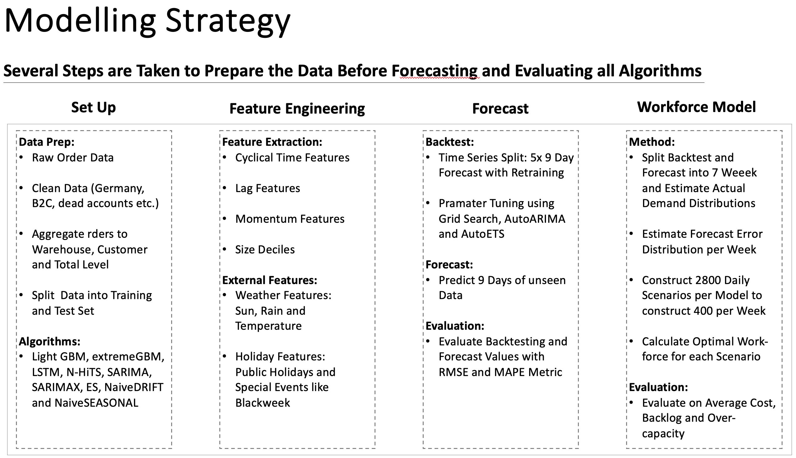

# Order Forecasting and Cost Reduction

This repository contains the official implementation of the paper "Enhancing E-Commerce Fulfillment Operations: Machine Learning Approaches for Order Forecasting and Cost Reduction." The paper is currently under development by Ludwig Baunach and co-author Stefan Spinler.

Please note, the code here is a subset of scripts from our private projects, and therefore the file paths are not relevant. The repository's intent is to provide a methodological overview of our paper's work.

**Note:** Unfortunately, we cannot share our data due to a Non-Disclosure Agreement (NDA).

## How to Navigate and Use the Code

**Main Folder:** The main folder contains all the primary scripts. It serves as a good starting point to understand the code flow.

**Running the Code:** To use the code, start by running `main_data_prep.py` for data pre-processing. After that, execute `main_forecasting.py` to perform forecasting, create ensembles, and initiate workforce optimization. Note that you'll need to specify the sources you wish to run.

**Code Structure:** The repository is organized into several key folders, each serving a specific purpose:
- `data_prep`: Contains scripts for data wrangling and preparation.
- `model`: Houses the forecasting model scripts.
- `evaluation`: Includes scripts for evaluating the models' performance.
- `simulation`: Contains scripts for workforce scheduling simulations.

**Utilities:** The `utils` folder contains custom functions used throughout the main scripts.

## Requirements
The code is currently under development. Once the paper gets accepted by a journal, we will add example data and a `requirements.txt` file detailing the necessary libraries and their versions.

## Runtime
On our dataset, the code takes approximately 30 hours to run on a machine with a 2.4 GHz Quad-Core Intel Core i5, 8GB 2133 MHz LPDDR3 RAM, Intel Iris Plus Graphics 655 1536 MB, running macOS.

# Introduction to the research

## Research Question

How does applying novel machine learning methods affect workforce planning of warehouse operations in the e-commerce context?

To answer this question, the following hypothesises will be tested:

- **Hypothesis 1:** Machine learning methods outperform statistical methods which will in turn
outperform deep learning methods.
- **Hypothesis 2:** Ensembles of best methods outperform single methods
- **Hypothesis 3:** External data improves forecasting accuracy significantly
- **Hypothesis 4:** Machine learning forecasts lead to more accurate workforce planning and there-
fore to significant cost reduction

## Methods 

